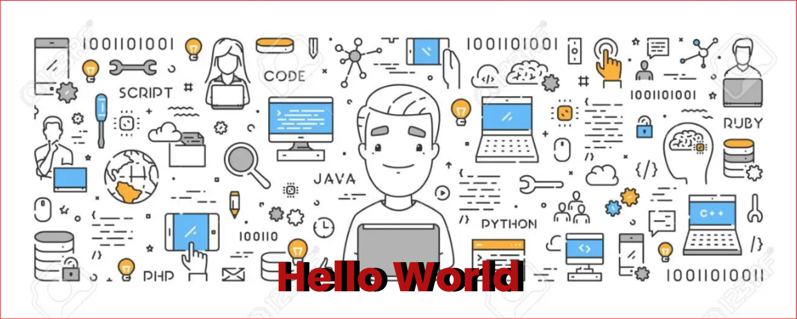

[]

# Hi there, I'm Paul - aka [HardcoreMuse] 👋 

## I'm a Husband, Father, Developer, and Teacher!!

- 🌱 I’m currently learning everything I can 🤣
- 👯 I’m looking to collaborate with other content creators
- 🥅 2023 Goals: Learn more about web3
- ⚡ Fun fact: I love to do Pixel Art and play around with NFTs

### Connect with me:

&nbsp;&nbsp;

&nbsp;&nbsp;

&nbsp;&nbsp;

&nbsp;&nbsp;

### Languages and Tools:

 
 

---

### GitHub Trophies

  
:zap: Recent GitHub Activity

  
# :zap: Recent Activity

<!--RECENT_ACTIVITY:start-->
1. ⬆️ Pushed 1 commit(s) to [HardcoreMuse/HardcoreMuse](https://github.com/HardcoreMuse/HardcoreMuse)
2. ⬆️ Pushed 1 commit(s) to [HardcoreMuse/HardcoreMuse](https://github.com/HardcoreMuse/HardcoreMuse)
3. ⬆️ Pushed 1 commit(s) to [HardcoreMuse/HardcoreMuse](https://github.com/HardcoreMuse/HardcoreMuse)
4. ⬆️ Pushed 2 commit(s) to [HardcoreMuse/HardcoreMuse](https://github.com/HardcoreMuse/HardcoreMuse)
5. ⬆️ Pushed 1 commit(s) to [HardcoreMuse/HardcoreMuse](https://github.com/HardcoreMuse/HardcoreMuse)
<!--RECENT_ACTIVITY:end-->

  
:zap: GitHub Stats

  

[website]: https://www.google.com
[twitter]: https://twitter.com/ScriptPixel
[youtube]: https://youtube.com/
[instagram]: https://instagram.com/
[linkedin]: www.linkedin.com/in/paul-sisson
